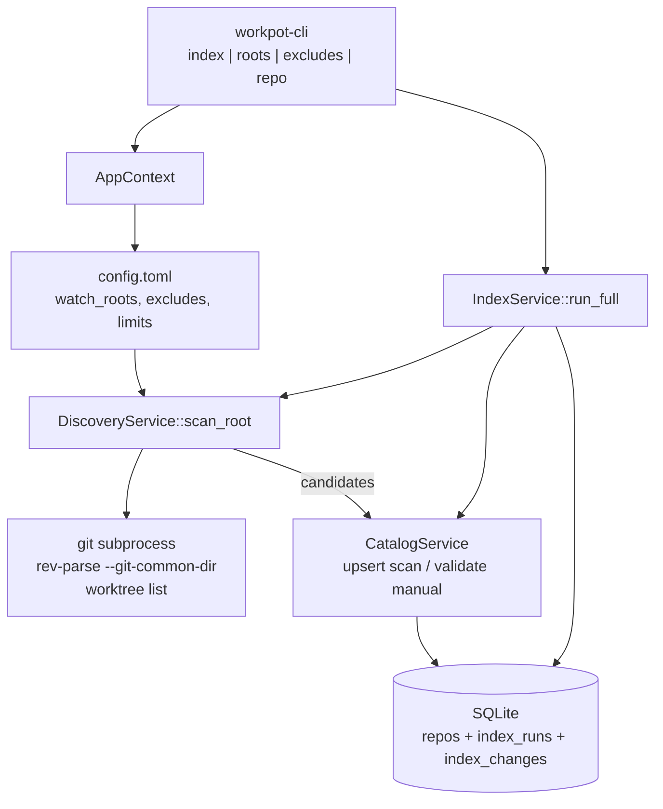

# Phase 2: Repo discovery - Research

**Researched:** 2026-05-29
**Domain:** Filesystem discovery, git repo identity (`git_common_dir`), config-driven watch roots/excludes, SQLite index merge + scan history
**Confidence:** HIGH (walk/glob stack, git identity API); MEDIUM (bare/worktree enumeration edge cases, built-in exclude list tuning)

## Summary

Phase 2 delivers **on-demand discovery** under explicit watch roots: walk the filesystem, detect `.git` (directory, gitfile, or bare layout), merge into SQLite with `source=manual|scan`, honor exclude globs, and expose `workpot index`, `workpot roots`, and `workpot excludes`. No `notify` watcher, no git2 status (Phase 3), no tray.

**Primary recommendation:** Add **`walkdir` 2.5.0** for traversal (`follow_links(false)` per D-02) and **`globset` 0.4.18** for built-in + user exclude globs. Resolve **`git_common_dir`** via **`git -C <path> rev-parse --git-common-dir`** (subprocess — keeps Phase 1 “no git2 crate” intact until Phase 3). Implement discovery in `services/discovery.rs`, orchestration in `services/index.rs`, migration `002_discovery.sql` for `git_common_dir` + `index_runs` / `index_changes`. Use **`filter_entry` + `skip_current_dir`** to prune exclude dirs and to stop descending into an already-indexed repo tree (D-01); after bare repo detection, run **`git worktree list --porcelain`** to add linked worktree rows (D-04).

## Architectural Responsibility Map

| Capability | Primary Tier | Secondary Tier | Rationale |
|------------|-------------|----------------|-----------|
| Watch-root filesystem walk | **Rust core (`infra/discovery` or `services/discovery`)** | — | No UI; shared by CLI and future tray `index` |
| Exclude glob matching | **Rust core** | Config TOML | Scan-time only; manual add bypasses (D-11) |
| `git_common_dir` resolution | **Rust core** | `git` CLI subprocess | Phase 1 defers git2; plumbing command is stable [CITED: git-scm.com git-rev-parse] |
| Index merge / stale removal | **Rust core (`services/index`)** | SQLite | Single-writer DB; transactional cap semantics (D-18) |
| Watch roots / excludes CRUD | **Rust core + config save** | CLI (`clap`) | D-19, D-12 |
| Scan history persistence | **Rust core (`infra/store`)** | — | D-17 audit trail |
| Git branch/dirty/ahead-behind | **— (Phase 3)** | — | Explicitly out of phase boundary |

## Project Constraints (from CLAUDE.md)

- **Platform:** macOS only v1 — paths via `directories`; discovery must tolerate iCloud/unreadable dirs without aborting whole scan.
- **Privacy:** Local-only — no network; discovery is filesystem + optional local `git` subprocess only.
- **Discovery:** Explicit watch roots + manual register/exclude; **no** `$HOME`-wide default crawl (PITFALLS #2).
- **Search:** Metadata-only v1 — Phase 2 indexes paths/names/`git_common_dir` only.
- **Stack direction:** Rust shared core, SQLite, TOML, clap; **notify deferred** (on-demand scan only per CONTEXT).

<user_constraints>

## User Constraints (from CONTEXT.md)

### Locked Decisions

#### Discovery traversal
- **D-01:** Skip nested `.git` inside an already-indexed repository tree (reduces submodule noise under a parent checkout).
- **D-02:** Index both bare repositories and normal worktrees; symlinked directories are not followed during walks.
- **D-03:** Sibling worktrees outside the parent tree are discovered as separate paths; all worktree paths are indexed (one logical repo, multiple rows/paths).
- **D-04:** Bare repos: persist a row for the bare path **and** separate rows for each linked worktree path.

#### Repo identity & grouping
- **D-05:** Stable grouping key is canonical absolute `git_common_dir` (not user-facing path alone) — paths may move/rename; directory paths are not the long-term identity.
- **D-06:** Phase 2 may keep `path` as row lookup/unique key per checkout; link rows sharing the same `git_common_dir`. Planner to define schema migration from Phase 1 path-only model.
- **D-07:** If a repo directory moves: treat as missing on rescan (auto-remove stale path) and new discovery creates a new row — no automatic path re-key in Phase 2.

#### Exclude semantics
- **D-08:** Config `excludes` entries are **glob patterns** matched during discovery walks.
- **D-09:** Ship built-in default exclude globs (e.g. `node_modules`, `.git` internals, `.Trash`, common build dirs) in addition to user config.
- **D-10:** `workpot repo remove <path>` deletes the DB row **and** appends a parent+name exclude glob to config (e.g. `{parent}/foo/**`) so rescan will not re-add; user edits config or uses excludes CLI to undo.
- **D-11:** Manual `workpot repo add` is allowed even when path matches an exclude glob (manual overrides scan-only excludes).
- **D-12:** `workpot excludes list|remove` manages exclude globs in Phase 2 (not config-only).

#### Rescan & `workpot index`
- **D-13:** Top-level command `workpot index` performs full watch-root discovery (INDEX-05).
- **D-14:** On rescan, rows with `source=manual` stay manual when also under a watch root.
- **D-15:** Paths that no longer exist on disk are auto-removed during index (manual and scan).
- **D-16:** Manual-only repos outside watch roots are not discovered anew but are **validated** on index (still exists, still git).
- **D-17:** Default output: one summary line (counts added/removed/skipped); persist **index run history** (one row per scan) and a **per-scan change log** (added/removed/skipped paths with full directory). Git “update” deltas deferred to Phase 3.
- **D-18:** When repo cap is reached during scan: **stop with error**, exit code 1 (no partial index).

#### Watch roots (INDEX-01)
- **D-19:** `workpot roots add|list|remove` plus hand-editing `config.toml` both supported; reload on next open/index.
- **D-20:** `workpot roots add` triggers an immediate scan of that root.
- **D-21:** `workpot roots remove` prunes all indexed repos under that root by default; `--skip-prune` keeps existing rows.
- **D-22:** No practical cap on watch-root count for normal use; enforce **max watch roots: 100 default**, configurable up to **5000 hard max** (security / abuse guard).
- **D-23:** **Max indexed repos: 1000 default**, configurable up to **20000 hard max**; same rationale.

#### Limits & security
- **D-24:** Hard caps are not expected in normal use; they exist to prevent pathological scans/memory use.

### Claude's Discretion

- Exact built-in default glob list; walk implementation (`walkdir` vs alternatives); schema details for `git_common_dir`, scan history tables, and how `repo_git_id` is exposed if distinct from `git_common_dir`; validation rules for config limit fields.

### Deferred Ideas (OUT OF SCOPE)

- Interactive first-run watch-root wizard (`~` depth-2 scan + multi-select) — after roots CLI lands.
- Filesystem watcher (`notify`) for automatic re-index — architecture Phase 9 / post-v1 tray freshness.
- Bare vs normal **mode** switching, clone-as-bare/normal, repo+branch **launch** UX — Phases 3–4+.
- Worktree **creation** by Workpot (`barerepo.git/wt/{name}` convention) — not Phase 2.
- Index change log “update” rows for git ahead/behind — Phase 3 git snapshot.
- Automatic path re-key on directory move (same `git_common_dir`) — user chose stale-remove + rediscover for Phase 2.

</user_constraints>

<phase_requirements>

## Phase Requirements

| ID | Description | Research Support |
|----|-------------|------------------|
| INDEX-01 | User can configure one or more watch roots that are scanned for git repositories | `Config.watch_roots` + `workpot roots add\|list\|remove`; `roots add` triggers scan (D-20); config reload on next `AppContext::open` |
| INDEX-02 | User can manually add a repository path to the index | Existing `catalog::register_manual` (D-11: ignores scan excludes) |
| INDEX-03 | User can exclude a path from indexing (even under a watch root) | User `excludes` globs + built-in defaults (D-08–D-09); `repo remove` appends exclude glob (D-10); `workpot excludes list\|remove` (D-12) |
| INDEX-04 | System detects repositories by presence of `.git` (not by folder name alone) | Reuse `is_git_worktree` / `is_bare_repo` from `catalog.rs`; discovery only registers paths passing those checks |
| INDEX-05 | User can trigger a full re-scan of watch roots from CLI or tray | `workpot index` (D-13); tray deferred to Phase 4 — CLI satisfies INDEX-05 for this phase |

</phase_requirements>

## Standard Stack

### Core (new in Phase 2)

| Library | Version | Purpose | Why Standard |
|---------|---------|---------|--------------|
| **walkdir** | **2.5.0** | Recursive directory traversal | [CITED: docs.rs/walkdir 2.5.0] — `follow_links(false)`, `filter_entry`, `skip_current_dir` for prune; errors per-entry without aborting whole walk |
| **globset** | **0.4.18** | Built-in + user exclude globs | [CITED: docs.rs/globset 0.4.18] — same ecosystem as ripgrep/`ignore`; `GlobSet::is_match` on full paths |

### Retained from Phase 1

| Library | Version | Purpose |
|---------|---------|---------|
| rusqlite + rusqlite_migration | 0.39 / 2.5 | Schema v2 + history tables |
| serde + toml | 1 / 0.8 | Config + limits |
| directories | 6.0 | Paths unchanged |
| clap | 4.x | `index`, `roots`, `excludes` subcommands |

### Explicitly not added in Phase 2

| Library | Why defer |
|---------|-----------|
| **git2** | Phase 1 lock: filesystem validation only until Phase 3 git snapshot; use `git` subprocess for `git_common_dir` + worktree list |
| **ignore** | Optimized for `.gitignore` during *content* walks; discovery must *detect* `.git` at repo roots and apply Workpot exclude globs, not repo ignore rules. Revisit if watch-root walks need gitignore-aware pruning at scale (STACK.md Phase 9 watcher path) |
| **notify** | On-demand scan only (CONTEXT deferred) |

### Alternatives Considered

| Instead of | Could Use | Tradeoff |
|------------|-----------|----------|
| walkdir + globset | **ignore** crate | `ignore` skips `.git` dirs by default — wrong default for “find all repos”; extra glue for Workpot excludes |
| walkdir | **`find` / `fd` subprocess** | PITFALLS: permission noise, no nested-git policy, harder cap enforcement — spike only |
| `git rev-parse` subprocess | **git2 `Repository::discover`** | Correct but violates Phase 1 no-git2-until-3; migrate in Phase 3 with status batching |
| path-only rows | **remote URL dedupe** | ARCHITECTURE anti-pattern #3 — conflicts with path-as-checkout identity |

**Installation (`workpot-core/Cargo.toml`):**

```toml
walkdir = "2.5.0"
globset = "0.4.18"
```

**Version verification (2026-05-29, `cargo search`):** walkdir 2.5.0, globset 0.4.18.

## Package Legitimacy Audit

> slopcheck unavailable in research environment — all packages tagged for planner `checkpoint:human-verify` before lock.

| Package | Registry | Age | Downloads | Source Repo | slopcheck | Disposition |
|---------|----------|-----|-----------|-------------|-----------|-------------|
| walkdir | crates.io | mature (BurntSushi) | very high | github.com/BurntSushi/walkdir | n/a | Approved pending human-verify |
| globset | crates.io | mature (BurntSushi) | very high | github.com/BurntSushi/ripgrep/tree/master/crates/globset | n/a | Approved pending human-verify |

**Packages removed due to slopcheck [SLOP] verdict:** none  
**Packages flagged as suspicious [SUS]:** none  

## Architecture Patterns

### System Architecture Diagram



### Recommended Project Structure

```
crates/workpot-core/src/
├── domain/
│   ├── config.rs          # + Limits { max_watch_roots, max_repos }
│   └── repo.rs            # + git_common_dir on RepoRecord
├── services/
│   ├── catalog.rs         # extend: upsert_scan, remove_with_exclude
│   ├── discovery.rs       # NEW: walk roots, detect .git, nested skip
│   ├── index.rs           # NEW: full rescan orchestration, caps, history
│   ├── roots.rs           # NEW: add/list/remove watch roots
│   └── excludes.rs        # NEW: list/remove exclude globs
├── infra/
│   └── migrations/
│       ├── 001_init.sql
│       └── 002_discovery.sql
crates/workpot-cli/src/main.rs   # wire subcommands
```

### Pattern 1: Prune-on-repo discovery walk

**What:** Depth-first walk of each watch root; when a directory is a git worktree or bare repo, record it and **do not descend** (D-01). Do not follow symlinks (D-02).

**When:** Every `workpot index` and `workpot roots add`.

**Example:**

```rust
// Source: https://docs.rs/walkdir/latest/walkdir/struct.WalkDir.html
// Source: https://context7.com/burntsushi/walkdir/llms.txt
let mut walk = WalkDir::new(root)
    .follow_links(false)
    .sort_by_file_name()
    .into_iter();

while let Some(entry) = walk.next() {
    let entry = entry?;
    if exclude_set.is_match(entry.path()) {
        if entry.file_type().is_dir() {
            walk.skip_current_dir();
        }
        continue;
    }
    if entry.file_type().is_dir() && is_repo_root(entry.path()) {
        candidates.push(entry.path().to_path_buf());
        walk.skip_current_dir(); // D-01: no nested .git under this tree
    }
}
```

### Pattern 2: Exclude `GlobSet` (built-in ∪ user)

**What:** Build one `GlobSet` from compiled-in defaults + `config.excludes`. Match **absolute** paths (canonicalize watch root + use `std::path::MAIN_SEPARATOR` aware patterns).

**Recommended built-in defaults (discretion — tune in execute):**

| Glob | Rationale |
|------|-----------|
| `**/node_modules/**` | PITFALLS #2 — massive false trees |
| `**/target/**` | Rust build artifacts |
| `**/.Trash/**`, `**/.Trash-*/**` | macOS trash |
| `**/build/**`, `**/dist/**`, `**/.build/**` | Common output dirs |
| `**/.git/modules/**` | Submodule gitdirs (PITFALLS #3) |
| `**/DerivedData/**` | Xcode |
| `**/Library/Caches/**` | macOS cache under broad roots [ASSUMED: safe for dev roots] |

**Example:**

```rust
// Source: https://docs.rs/globset/latest/globset/struct.GlobSet.html
let mut builder = GlobSetBuilder::new();
for pat in built_in_defaults().iter().chain(config.excludes.iter()) {
    builder.add(Glob::new(pat)?);
}
let exclude_set = builder.build()?;
```

### Pattern 3: `git_common_dir` via git CLI (no git2 crate)

**What:** After path is a valid repo, resolve grouping key:

```rust
// Source: https://git-scm.com/docs/git-rev-parse#Documentation/git-rev-parse.txt---git-common-dir
let output = Command::new("git")
    .args(["-C", path.to_str()?, "rev-parse", "--git-common-dir"])
    .output()?;
let common = PathBuf::from(String::from_utf8(output.stdout)?.trim());
let git_common_dir = std::fs::canonicalize(common)?; // absolute for D-05
```

Store `git_common_dir.display().to_string()` on row; keep `path` as PRIMARY KEY (D-06).

**Bare + linked worktrees (D-04):** After indexing bare path, run `git -C <bare> worktree list --porcelain` and upsert each worktree path as `source=scan` with same `git_common_dir`. [CITED: git-scm.com git-worktree listing]

### Pattern 4: Transactional index merge with hard cap

**What:**

1. Begin transaction.
2. Discover all candidates (may collect paths in memory — cap check before INSERT).
3. If `existing + new > max_repos` → **rollback**, record failed `index_runs` row, exit 1 (D-18).
4. Upsert scan rows; delete stale paths (D-15); validate manual-only rows (D-16); preserve `source=manual` (D-14).
5. Write `index_changes` + commit.

**Anti-pattern:** Inserting repos one-by-one then failing mid-scan — violates D-18.

### Pattern 5: `repo remove` → exclude glob (D-10)

**What:** On remove, append `{parent_canonical}/{dir_name}/**` to `config.excludes`, persist config, DELETE row.

```rust
let parent = path.parent().ok_or(...)?;
let name = path.file_name().ok_or(...)?;
let glob = format!("{}/{}/*", parent.display(), name.to_string_lossy());
// Use ** suffix per user decision: "{parent}/foo/**"
```

### Anti-Patterns to Avoid

- **Descending into every `.git` directory:** Wastes I/O; detect repo at parent directory only.
- **Following symlinks:** Violates D-02; walkdir default is correct (`follow_links(false)`).
- **Using folder name `*.git` as repo signal:** INDEX-04 requires `.git` or bare layout — keep `catalog.rs` validators.
- **Partial index on cap:** D-18 requires abort with no durable partial merge.
- **Re-keying path on move:** D-7 — stale delete + rediscover only.

## Don't Hand-Roll

| Problem | Don't Build | Use Instead | Why |
|---------|-------------|-------------|-----|
| Directory traversal with prune | Custom `read_dir` recursion | **walkdir** + `skip_current_dir` | Loop/symlink edge cases, fd limits (`max_open`) |
| Glob exclude matching | Regex on path strings | **globset** | `**`, `{}`, path separators handled |
| Git common dir / worktree list | Parse `.git` files ad hoc for all layouts | **`git rev-parse` / `git worktree list`** | Linked worktrees, bare, submodule gitdirs — easy to get wrong |
| Migration versioning | Ad-hoc `ALTER` in code | **rusqlite_migration** `002_*.sql` | Same as Phase 1 |
| Scan audit log | Ad-hoc JSON file | **SQLite `index_runs` + `index_changes`** | Queryable, consistent with DATA-01 |

**Key insight:** Discovery is deceptively complex at git worktree/bare boundaries; subprocess git for identity only is cheaper than shipping git2 early and still meets D-05.

## Common Pitfalls

### Pitfall 1: Submodule `.git` dirs indexed as repos

**What goes wrong:** Parent monorepo + `vendor/foo/.git` pollutes index.  
**Why:** Naive “any `.git`” without tree pruning.  
**How to avoid:** D-01 `skip_current_dir` after registering parent repo root.  
**Warning signs:** Duplicate remotes / same `git_common_dir` with nested paths.

### Pitfall 2: Symlinked watch roots or repos

**What goes wrong:** Escapes intended root or duplicates paths.  
**How to avoid:** D-02 `follow_links(false)`; canonicalize stored paths.  
**Warning signs:** Same repo twice with different spellings.

### Pitfall 3: Cap exceeded mid-transaction

**What goes wrong:** Partial DB state vs D-18.  
**How to avoid:** Pre-count candidates or two-phase: discover to temp vec → check len → single transactional write.  
**Warning signs:** `index_runs` shows ok but repo count jumped past max.

### Pitfall 4: Exclude glob doesn’t block rescan

**What goes wrong:** User removed repo but scan re-adds.  
**How to avoid:** D-10 parent/name glob; match absolute paths in walker.  
**Warning signs:** Remove succeeds, `workpot index` re-adds same path.

### Pitfall 5: `git` missing on PATH

**What goes wrong:** Cannot resolve `git_common_dir`.  
**How to avoid:** Clear `WorkpotError` (“install Xcode CLT / git”); fail index for affected paths, not silent empty key.  
**Warning signs:** Rows with empty `git_common_dir` after migration.

### Pitfall 6: Broad watch root without excludes

**What goes wrong:** Scan minutes, thousands of false positives.  
**How to avoid:** Built-in defaults (D-09) + document narrow roots; caps (D-22–D-23).  
**Warning signs:** High `skipped` count, cap errors.

## Code Examples

### Exclude check + prune directory

```rust
// Source: https://context7.com/burntsushi/walkdir/llms.txt
if exclude_set.is_match(entry.path()) {
    if entry.file_type().is_dir() {
        it.skip_current_dir();
    }
    continue;
}
```

### GlobSet build

```rust
// Source: https://context7.com/burntsushi/globset/llms.txt
let mut builder = GlobSetBuilder::new();
builder.add(Glob::new("**/node_modules/**")?);
let set = builder.build()?;
assert!(set.is_match("/Users/dev/foo/node_modules/pkg"));
```

### Schema migration sketch (`002_discovery.sql`)

```sql
ALTER TABLE repos ADD COLUMN git_common_dir TEXT NOT NULL DEFAULT '';

CREATE TABLE index_runs (
  id INTEGER PRIMARY KEY AUTOINCREMENT,
  started_at INTEGER NOT NULL,
  finished_at INTEGER,
  status TEXT NOT NULL CHECK (status IN ('ok', 'error', 'cap_exceeded')),
  added_count INTEGER NOT NULL DEFAULT 0,
  removed_count INTEGER NOT NULL DEFAULT 0,
  skipped_count INTEGER NOT NULL DEFAULT 0,
  message TEXT
);

CREATE TABLE index_changes (
  id INTEGER PRIMARY KEY AUTOINCREMENT,
  run_id INTEGER NOT NULL REFERENCES index_runs(id) ON DELETE CASCADE,
  path TEXT NOT NULL,
  action TEXT NOT NULL CHECK (action IN ('added', 'removed', 'skipped'))
);

CREATE INDEX idx_repos_git_common_dir ON repos(git_common_dir);
CREATE INDEX idx_index_changes_run ON index_changes(run_id);
```

### Config limits (discretion)

```toml
# Source: pattern from Phase 1 config.rs + D-22/D-23
[limits]
max_watch_roots = 100   # hard max 5000
max_repos = 1000        # hard max 20000
```

### CLI surface (prescriptive)

```
workpot index
workpot roots add|list|remove [--skip-prune]
workpot excludes list|remove <glob>
workpot repo add|list|remove   # remove gains exclude glob (D-10)
```

## State of the Art

| Old Approach (ARCHITECTURE.md) | Phase 2 Approach | Impact |
|------------------------------|------------------|--------|
| Path-only identity | `path` PK + `git_common_dir` grouping | Enables future grouping UI without re-key on move (D-7) |
| `walkdir` mentioned generically | walkdir + globset + git subprocess | Concrete stack for planner tasks |
| Refresh worker + git snapshot in index flow | Discovery-only index; git deferred Phase 3 | Phase 2 index is fast (no status) |

**Deprecated/outdated for this phase:**

- Treating Phase 2 as “index + branch/dirty” (PITFALLS pitfall #1) — discovery only.
- Using `ignore` crate as primary walker for repo discovery — wrong default semantics for `.git` detection.

## Assumptions Log

| # | Claim | Section | Risk if Wrong |
|---|-------|---------|---------------|
| A1 | `git` on PATH on macOS dev machines (Xcode CLT) | git_common_dir | Empty grouping key; need git2 fallback in Phase 3 |
| A2 | Built-in `Library/Caches` exclude safe for typical `~/code` roots | Excludes | Legitimate repos under that path never scanned |
| A3 | Pre-scan collect-all-then-insert fits 20k repo cap in memory | Caps | Need streaming cap check if memory an issue |
| A4 | `globset` patterns use `/` on macOS paths when matching | Excludes | User globs with `\` may not match — document POSIX-style |
| A5 | Tray INDEX-05 satisfied by CLI in Phase 2 only | Requirements | Phase 4 must wire tray to same `IndexService` |

## Open Questions

1. **Backfill `git_common_dir` for existing Phase 1 rows**
   - What we know: Migration adds column with DEFAULT ''.
   - Recommendation: First `workpot index` or lazy validation fills via `git rev-parse`; planner task in Wave 1.

2. **`repo_git_id` vs `git_common_dir` column name**
   - What we know: Discretion allows distinct exposed id.
   - Recommendation: Single column `git_common_dir` only in Phase 2; alias in API later if needed.

3. **Exact failure mode when `git rev-parse` fails for one path**
   - Recommendation: Skip with `skipped` in change log + warning on stderr; do not fail entire index unless all paths fail [ASSUMED — planner may tighten].

## Environment Availability

| Dependency | Required By | Available | Version | Fallback |
|------------|------------|-----------|---------|----------|
| rustc / cargo | build, test | ✓ | 1.85.1 | — |
| git CLI | `git_common_dir`, worktree list | ✓ | 2.54.0 | Fail with install hint; no git2 in Phase 2 |
| cargo-nextest | fast tests | ✗ | — | `cargo test` |
| slopcheck | package audit | ✗ | — | Human-verify walkdir/globset |
| Xcode CLT | macOS dev | [ASSUMED] ✓ | — | Required for contributors |

**Missing dependencies with no fallback:**

- None blocking (git required for full D-05 compliance).

## Validation Architecture

### Test Framework

| Property | Value |
|----------|-------|
| Framework | Rust `#[test]` + `cargo test` |
| Config file | none |
| Quick run command | `cargo test -p workpot-core` |
| Full suite command | `cargo test --workspace` |

### Phase Requirements → Test Map

| Req ID | Behavior | Test Type | Automated Command | File Exists? |
|--------|----------|-----------|-------------------|-------------|
| INDEX-01 | Watch root scan finds nested repo | integration | `cargo test -p workpot-core discovery_finds_repo_under_root` | ❌ Wave 0 |
| INDEX-01 | `roots add` persists root + triggers scan | integration | `cargo test -p workpot-core roots_add_triggers_scan` | ❌ Wave 0 |
| INDEX-02 | Manual add outside watch root | integration | extend `catalog_test.rs` patterns | ✅ partial |
| INDEX-03 | Exclude glob prevents re-add | integration | `cargo test -p workpot-core exclude_blocks_rescan` | ❌ Wave 0 |
| INDEX-03 | `repo remove` writes exclude glob | integration | `cargo test -p workpot-core remove_appends_exclude` | ❌ Wave 0 |
| INDEX-04 | Non-git dir not indexed | integration | `cargo test -p workpot-core discovery_skips_plain_dir` | ❌ Wave 0 |
| INDEX-04 | Bare + gitdir worktree detected | integration | reuse fixtures from `catalog_test.rs` | ✅ partial |
| INDEX-05 | `workpot index` idempotent summary | integration | `cargo test -p workpot-core index_full_rescan` | ❌ Wave 0 |
| D-01 | Nested `.git` under parent skipped | integration | `cargo test -p workpot-core discovery_skips_nested_git` | ❌ Wave 0 |
| D-18 | Cap exceeded → exit error, no new rows | integration | `cargo test -p workpot-core index_cap_abort` | ❌ Wave 0 |
| D-14 | Manual source preserved on rescan | integration | `cargo test -p workpot-core index_preserves_manual_source` | ❌ Wave 0 |

### Sampling Rate

- **Per task commit:** `cargo test -p workpot-core`
- **Per wave merge:** `cargo test --workspace`
- **Phase gate:** Full suite green + ROADMAP manual criteria (watch root → nested repos, exclude, rescan)

### Wave 0 Gaps

- [ ] Tempdir fixtures: watch root tree with 2 repos + nested submodule-style `.git`
- [ ] `tests/discovery_test.rs` or `tests/index_test.rs`
- [ ] `tests/roots_test.rs`, `tests/excludes_test.rs`
- [ ] CLI smoke tests via `std::process::Command` calling `workpot` binary [ASSUMED optional Wave 2]
- [ ] Mock `git` only if CI lacks it — macOS CI should use real git

## Security Domain

### Applicable ASVS Categories (ASVS L1, local CLI)

| ASVS Category | Applies | Standard Control |
|---------------|---------|------------------|
| V2 Authentication | no | N/A |
| V3 Session Management | no | N/A |
| V4 Access Control | yes | Watch roots are user-configured boundaries; do not follow symlinks out of root (D-02) |
| V5 Input Validation | yes | Canonicalize paths; validate watch roots exist; clamp limits to hard max (D-22–D-24) |
| V6 Cryptography | no | N/A |

### Known Threat Patterns

| Pattern | STRIDE | Standard Mitigation |
|---------|--------|---------------------|
| Pathological scan (DoS self) | Denial of Service | `max_repos` / `max_watch_roots` hard caps (D-18, D-24) |
| Symlink escape from watch root | Elevation / Tampering | `follow_links(false)` |
| SQL injection via paths | Tampering | rusqlite parameterized queries (Phase 1 pattern) |
| Untrusted config TOML | Tampering | Parse with serde; reject limits > hard max |
| `git` subprocess injection | Tampering | Fixed argv; path validated as UTF-8 directory — no shell |

## Sources

### Primary (HIGH confidence)

- [/burntsushi/walkdir](https://context7.com/burntsushi/walkdir/llms.txt) — `filter_entry`, `skip_current_dir`, `follow_links`
- [/burntsushi/globset](https://context7.com/burntsushi/globset/llms.txt) — `GlobSetBuilder`, `is_match`
- [docs.rs walkdir 2.5.0](https://docs.rs/walkdir/latest/walkdir/struct.WalkDir.html) — API defaults
- [docs.rs globset 0.4.18](https://docs.rs/globset/latest/globset/struct.GlobSet.html) — path matching
- [git-scm.com git-rev-parse --git-common-dir](https://git-scm.com/docs/git-rev-parse) — D-05 identity
- [git-scm.com git-worktree](https://git-scm.com/docs/git-worktree) — porcelain worktree list (D-04)
- Codebase: `catalog.rs`, `001_init.sql`, `config.rs`, Phase 1/2 CONTEXT

### Secondary (MEDIUM confidence)

- `.planning/research/PITFALLS.md` — nested git, broad roots, caps
- `.planning/research/ARCHITECTURE.md` — discovery service placement
- `.planning/research/STACK.md` — ignore/notify deferred
- `cargo search` — crate versions 2026-05-29

### Tertiary (LOW / ASSUMED)

- Built-in exclude list completeness for macOS — tune in execute (A2)
- Skip-vs-fail policy for single-path `git rev-parse` errors (Open Question 3)

## Metadata

**Confidence breakdown:**

- Standard stack: **HIGH** — walkdir/globset verified on crates.io + docs
- Architecture: **HIGH** — aligned with locked CONTEXT + existing `catalog.rs`
- Pitfalls: **MEDIUM** — worktree/submodule edge cases need fixture tests
- git subprocess: **HIGH** for identity; **MEDIUM** for exotic worktree layouts

**Research date:** 2026-05-29  
**Valid until:** 2026-06-28 (stable Rust ecosystem; re-verify if git2 lands early)
