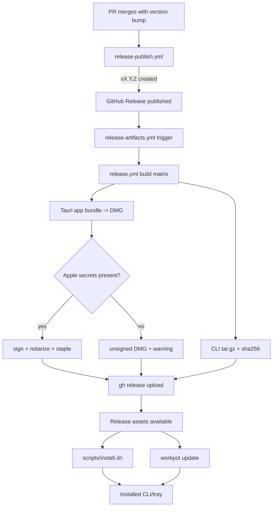

# Phase 06.1: Release & distribution - Research

**Researched:** 2026-05-31
**Domain:** macOS release distribution (GitHub Releases, installer/update UX, DMG signing/notarization)
**Confidence:** HIGH

<user_constraints>
## User Constraints (from CONTEXT.md)

### Locked Decisions
- **D-01:** Default (no flags) installs **both** CLI and tray. Flags: `--only-cli`, `--only-tray`.
- **D-02:** CLI default path: `~/.local/bin/workpot` with PATH hint when missing. `--global` installs CLI (and tray when applicable) to system-wide locations for all users (see D-20).
- **D-03:** Tray default path: `~/Applications/Workpot.app` (no admin for default install).
- **D-04:** Tray artifact: download release **`.dmg`**, mount, copy `Workpot.app` out (same artifact family as GUI install path).
- **D-05:** Version pinning: **latest GitHub release only** for v1 (no `--version` / `WORKPOT_VERSION`).
- **D-06:** Default updates **both** CLI and tray (same as install.sh default).
- **D-07:** Mirrors install.sh flags: `--only-cli`, `--only-tray`, `--global`.
- **D-08:** When installed version equals latest release: **exit 0** with “already up to date” (no download).
- **D-09:** Exit codes: **0** success or already-current; **1** permission / install failure; **2** network or GitHub API failure. Leave existing install untouched on failure.
- **D-10:** Detect what to update by **presence**: `~/.local/bin/workpot` (or global CLI path); `~/Applications/Workpot.app` (or global tray path). No install manifest file in v1.
- **D-11:** DMG layout: **Workpot.app + standard drag target** (Applications folder alias/README) — not app-only.
- **D-12:** **Equal prominence** in `INSTALL.md`: DMG path and `curl | bash` are both first-class; same release version.
- **D-13:** **Per-arch DMG** naming includes version, e.g. `Workpot-0.1.0-aarch64.dmg` (exact pattern at planner discretion; must be unambiguous on Releases page).
- **D-14:** **aarch64-only for this phase** — drop **all** x86_64 release artifacts (CLI tarballs and DMG). CI matrix and docs updated accordingly.
- **D-15:** CLI tarball remains aarch64-only: `workpot-macos-aarch64.tar.gz` + `.sha256` (align naming with existing release workflow where practical).
- **D-16:** Script lives at **`scripts/install.sh`**. Document **both** install URLs: convenience `raw.githubusercontent.com/.../main/scripts/install.sh` and **versioned** `install.sh` attached to each GitHub Release for reproducible installs.
- **D-17:** Downloaded release assets (tarball, DMG) must be verified against published **`.sha256`** checksums; fail closed on mismatch.
- **D-18:** If Apple signing secrets are absent, **ship unsigned** with clear log/README warning (best-effort signing — do not block fork/local experimentation).
- **D-19:** When secrets are present: **signed + notarized + stapled** `.app`/`.dmg` is the bar before upload to GitHub Releases.

### Claude's Discretion
- **D-20:** `--global` paths: **`/usr/local/bin/workpot`** and **`/Applications/Workpot.app`**, using `sudo` when needed (standard macOS layout).
- **D-21:** **Uninstall:** `INSTALL.md` only — document removing CLI binary, `~/Applications` (or global) app, and optional config/data paths; no `workpot uninstall` subcommand in v1.
- **D-22:** **Post-install:** print next steps only (do not auto-open app or add Login Items in v1).
- **D-23:** **Tray running during update:** detect running Workpot; **exit 1** with instruction to quit from menu bar before replace (no silent kill).
- Exact DMG window branding, `hdiutil` error messages, and retry policy in install/update scripts.
- Whether `install.sh` uses `bash` strict mode flags beyond `set -euo pipefail`.
- Global-path detection heuristics when both user and global installs exist (prefer explicit flags).

### Deferred Ideas (OUT OF SCOPE)
- `workpot uninstall` subcommand — user did not discuss; v1 uses INSTALL.md steps only (D-21).
- `WORKPOT_VERSION` / pinned installs — deferred (D-05).
- x86_64 macOS support — deferred until explicitly reintroduced on roadmap.
- Tray auto-update inside the app — out of phase scope per ROADMAP.
- Auto-open app / Login Items after install — deferred (D-22).
</user_constraints>

## Project Constraints (from CLAUDE.md)

- macOS-only v1 surface is mandatory; release/distribution plan must not include Linux/Windows tracks. [CITED:https://github.com/rubenlr/workpot/blob/master/CLAUDE.md]
- Cursor integration remains required and should not regress while adding installer/update paths. [CITED:https://github.com/rubenlr/workpot/blob/master/CLAUDE.md]
- Local-only architecture remains required; release/update implementation must not introduce telemetry/account dependencies. [CITED:https://github.com/rubenlr/workpot/blob/master/CLAUDE.md]
- Shared Rust core + CLI/tray architecture should be preserved; avoid duplicating business logic across surfaces. [CITED:https://github.com/rubenlr/workpot/blob/master/CLAUDE.md]
- Planning artifacts may be edited directly in this orchestrated research flow (user explicitly requested this phase research). [VERIFIED: codebase]

<phase_requirements>
## Phase Requirements

| ID | Description | Research Support |
|----|-------------|------------------|
| SC-01 | Release publishes CLI tarball + checksum + aarch64 DMG | Standard Stack, Architecture Patterns, Validation Architecture |
| SC-02 | One-line installer installs CLI/tray correctly | Architecture Patterns, Code Examples, Common Pitfalls |
| SC-03 | `workpot update` handles success/current/error exit modes | Architecture Patterns, Common Pitfalls, Validation Architecture |
| SC-04 | `INSTALL.md` user-focused install/update/uninstall docs | Standard Stack, Anti-Patterns, Environment Availability |
| SC-05 | Maintainer docs/workflows updated for DMG + installer | Architecture Patterns, Validation Architecture |
</phase_requirements>

## Summary

Phase 06.1 is primarily a release-system composition problem, not a new product capability: wire existing versioning/release gates to publish additional assets, then consume those assets safely from installer and updater paths. Current automation already creates tags/releases and uploads CLI tarballs with checksums, but still includes x86_64 and has no installer/DMG lane. [VERIFIED: codebase]

The safest plan is to centralize release asset resolution and checksum verification once, then reuse it in both `scripts/install.sh` and `workpot update`. GitHub’s latest-release API and release-assets schema already provide enough metadata to resolve asset URLs deterministically; rely on that instead of scraping HTML. [CITED:https://docs.github.com/en/rest/releases/releases?apiVersion=2022-11-28#get-the-latest-release] [CITED:https://docs.github.com/en/rest/releases/assets?apiVersion=2022-11-28#list-release-assets]

For tray distribution, treat DMG signing/notarization as conditional hardening: when Apple credentials are present, build signed+notarized+stapled DMG; when absent, still publish unsigned DMG with explicit warning. This aligns with locked decisions and Tauri’s documented signing/notarization environment-variable model. [CITED:https://v2.tauri.app/distribute/sign/macos/] [VERIFIED: codebase]

**Primary recommendation:** Build one release-asset contract (names + checksums + failure taxonomy) and enforce it end-to-end across CI, installer, updater, and docs.

## Architectural Responsibility Map

| Capability | Primary Tier | Secondary Tier | Rationale |
|------------|-------------|----------------|-----------|
| Tag/release publication gate | GitHub Actions CI | Repository metadata (`version`, `CHANGELOG`) | Trigger and policy enforcement already live in workflows/scripts. [VERIFIED: codebase] |
| Artifact build (CLI tarball + DMG) | GitHub Actions macOS jobs | Tauri bundler / Rust compiler | Build outputs originate in CI build matrix. [VERIFIED: codebase] |
| Installer UX (`curl ... | bash`) | Client shell script (`scripts/install.sh`) | GitHub Releases API | User entrypoint is shell; asset metadata comes from release API. [CITED:https://docs.github.com/en/rest/releases/releases?apiVersion=2022-11-28#get-the-latest-release] |
| CLI self-update (`workpot update`) | CLI binary (`workpot-cli`) | Shared installer primitives | Same asset/verification logic as install flow with explicit exit codes. [VERIFIED: codebase] |
| DMG signing/notarization | CI secret-aware build stage | Apple notarization services | Tauri requires Apple credentials for notarization path. [CITED:https://v2.tauri.app/distribute/sign/macos/] |
| User documentation | `INSTALL.md` | `README.md` linkage | End-user flow must be decoupled from maintainer `docs/releasing.md`. [VERIFIED: codebase] |

## Standard Stack

### Core
| Library/Tool | Version | Purpose | Why Standard |
|---------|---------|---------|--------------|
| GitHub Releases REST API (`/releases/latest`, assets) | API version `2022-11-28` | Resolve latest release + exact asset URLs/names | Official source of truth for release assets and metadata. [CITED:https://docs.github.com/en/rest/releases/releases?apiVersion=2022-11-28#get-the-latest-release] [CITED:https://docs.github.com/en/rest/releases/assets?apiVersion=2022-11-28#list-release-assets] |
| GitHub Actions `release` event (`types: [published]`) | Current docs | Trigger artifact build from published release | Matches existing `release-artifacts.yml` pattern and avoids manual sync races. [CITED:https://docs.github.com/en/actions/using-workflows/events-that-trigger-workflows#release] [VERIFIED: codebase] |
| Tauri 2 macOS signing/notarization env contract | Tauri v2 docs | Sign/notarize/staple DMG path when secrets exist | Officially documented and compatible with conditional CI behavior. [CITED:https://v2.tauri.app/distribute/sign/macos/] |
| Existing repo release scripts/workflows | Current repo state | Version gating + release creation + upload orchestration | Already implemented and battle-tested in this repo. [VERIFIED: codebase] |

### Supporting
| Library/Tool | Version | Purpose | When to Use |
|---------|---------|---------|-------------|
| `curl` + `jq` + `shasum` + `tar` + `hdiutil` (macOS built-ins + jq) | Local env: curl 8.7.1, jq 1.8.1 | Installer/update fetch + parse + verify + extract/mount | Use in `scripts/install.sh` and optional helper scripts. [VERIFIED: codebase] |
| `gh release upload` | gh 2.93.0 | Upload generated artifacts into existing release | Keep uploader path consistent with existing `release.yml`. [VERIFIED: codebase] |
| `xcrun notarytool` + `xcrun stapler` + `codesign` | Local env available | Verify/execute Apple notarization flow in CI/local | Use only in signed path (secrets present). [CITED:https://v2.tauri.app/distribute/sign/macos/] [VERIFIED: codebase] |

### Alternatives Considered
| Instead of | Could Use | Tradeoff |
|------------|-----------|----------|
| GitHub REST latest release lookup | Hardcoded version/tag in script | Hardcoding violates D-05 and breaks one-line latest install. |
| Shared install/update primitives | Independent installer and updater logic | Duplicates checksum/parsing logic and drifts error semantics. |
| Conditional unsigned fallback | Hard fail when Apple secrets missing | Conflicts with D-18 and blocks fork/local release testing. |

**Installation:** no external package installation is required for this phase baseline; rely on existing toolchain and repo scripts. [VERIFIED: codebase]

## Package Legitimacy Audit

No new third-party package additions are required by this research baseline. Therefore package-legitimacy gate is not applicable for Phase 06.1 planning unless the planner introduces new dependencies later. [VERIFIED: codebase]

## Architecture Patterns

### System Architecture Diagram



### Recommended Project Structure
```text
scripts/
├── install.sh                # User installer entrypoint (new)
├── release-assets.sh         # Shared asset resolution + checksum helpers (new)
└── latest-released-version.sh

crates/workpot-cli/src/
├── main.rs                   # Add update command wiring
└── update.rs                 # Update flow + exit-code mapping (new)

.github/workflows/
├── release.yml               # Add DMG lane + aarch64-only matrix
└── release-smoke.yml         # Validate new artifact contract in PR
```

### Pattern 1: Release Asset Contract First
**What:** Define canonical asset names/patterns once (`workpot-macos-aarch64.tar.gz`, `.sha256`, `Workpot-<ver>-aarch64.dmg`, DMG checksum) and make CI + installer + updater all enforce it.
**When to use:** Any workflow/script/code that selects release artifacts.
**Example:**
```bash
# Source: GitHub Releases REST docs + project workflow conventions
latest_json="$(curl -fsSL "https://api.github.com/repos/${OWNER}/${REPO}/releases/latest")"
asset_url="$(echo "$latest_json" | jq -r '.assets[] | select(.name=="workpot-macos-aarch64.tar.gz") | .browser_download_url')"
checksum_url="$(echo "$latest_json" | jq -r '.assets[] | select(.name=="workpot-macos-aarch64.tar.gz.sha256") | .browser_download_url')"
```

### Pattern 2: Atomic Update with Staging + Verify + Replace
**What:** Download to temp dir, verify checksum, then replace target binary/app in one final step.
**When to use:** `workpot update` and `install.sh`.
**Example:**
```bash
# Source: release integrity requirement D-17
tmp_dir="$(mktemp -d)"
curl -fsSL "$asset_url" -o "$tmp_dir/asset"
curl -fsSL "$checksum_url" -o "$tmp_dir/asset.sha256"
(cd "$tmp_dir" && shasum -a 256 -c asset.sha256)
# only then copy/move into final install path
```

### Pattern 3: Secret-Gated DMG Signing Path
**What:** Branch release job by presence of Apple secrets; run signed path when available, unsigned fallback otherwise.
**When to use:** `release.yml` DMG generation job.
**Example:**
```yaml
# Source: Tauri macOS signing docs + D-18/D-19
if: env.APPLE_CERTIFICATE != '' && env.APPLE_CERTIFICATE_PASSWORD != ''
# signed/notarized/stapled branch
```

### Anti-Patterns to Avoid
- **Workflow/doc drift:** keeping ROADMAP/INSTALL/docs/releasing inconsistent with locked D-14 (aarch64-only).
- **Two different checksum implementations:** one in installer, another in updater.
- **In-place overwrite before verification:** can brick valid installs on partial downloads.
- **Implicit app-kill on tray update:** violates D-23 (must fail with instruction).

## Don't Hand-Roll

| Problem | Don't Build | Use Instead | Why |
|---------|-------------|-------------|-----|
| Release metadata discovery | HTML scraping GitHub release page | GitHub Releases REST endpoints | Stable schema + explicit fields (`assets`, `browser_download_url`). [CITED:https://docs.github.com/en/rest/releases/releases?apiVersion=2022-11-28#get-the-latest-release] |
| DMG signing/notarization flow | Custom ad-hoc Apple submission scripts from scratch | Tauri documented env-based signing/notarization pipeline | Reduces credential-handling mistakes and aligns with Tauri bundler behavior. [CITED:https://v2.tauri.app/distribute/sign/macos/] |
| Release trigger semantics | Manual release polling jobs | `on: release: types: [published]` workflows | Native event semantics already documented and used. [CITED:https://docs.github.com/en/actions/using-workflows/events-that-trigger-workflows#release] |

**Key insight:** Complexity here is contract consistency, not algorithms; custom paths fail by drift, not by performance.

## Common Pitfalls

### Pitfall 1: Locked-decision drift vs old roadmap text
**What goes wrong:** Planner follows `ROADMAP.md` line still mentioning x86_64 release artifacts.
**Why it happens:** Phase context newer than roadmap row.
**How to avoid:** Treat `06.1-CONTEXT.md` decisions D-14/D-15 as source of truth for this phase.
**Warning signs:** Any plan task keeps `macos-15-intel` runner or `workpot-macos-x86_64.tar.gz`.

### Pitfall 2: Installer/updater contract divergence
**What goes wrong:** `install.sh` and `workpot update` resolve different assets or checksums.
**Why it happens:** Logic implemented twice.
**How to avoid:** Shared helper contract + identical asset-name constants.
**Warning signs:** Same version installs one artifact set but updater fetches another.

### Pitfall 3: Non-atomic replacement
**What goes wrong:** Existing install overwritten before checksum validation or copy completes.
**Why it happens:** In-place writes.
**How to avoid:** Stage in temp dir, validate, then final move/copy.
**Warning signs:** Truncated binary/app after interrupted download.

### Pitfall 4: Incorrect release-event assumptions
**What goes wrong:** Workflows miss pre-release/draft edge cases.
**Why it happens:** Wrong `release` activity type choice.
**How to avoid:** Keep `published` for this phase to trigger on actual publication.
**Warning signs:** Published release exists but artifact workflow didn’t run.

## Code Examples

Verified patterns from official sources:

### GitHub release trigger
```yaml
# Source: https://docs.github.com/en/actions/using-workflows/events-that-trigger-workflows#release
on:
  release:
    types: [published]
```

### Get latest release metadata
```bash
# Source: https://docs.github.com/en/rest/releases/releases?apiVersion=2022-11-28#get-the-latest-release
curl -L \
  -H "Accept: application/vnd.github+json" \
  "https://api.github.com/repos/${OWNER}/${REPO}/releases/latest"
```

### Tauri notarization env inputs
```bash
# Source: https://v2.tauri.app/distribute/sign/macos/
export APPLE_API_ISSUER="..."
export APPLE_API_KEY="..."
export APPLE_API_KEY_PATH="/path/to/AuthKey_XXXX.p8"
# then run tauri build/bundle
```

## State of the Art

| Old Approach | Current Approach | When Changed | Impact |
|--------------|------------------|--------------|--------|
| Release tarballs only | Tarballs + DMG + installer + updater contract | This phase | End-user install path becomes self-service. |
| Dual-arch matrix (`aarch64`, `x86_64`) | aarch64-only (locked for 06.1) | This phase decision D-14 | Lower CI complexity/cost; Intel intentionally deferred. |
| Maintainer-only release docs | Split user (`INSTALL.md`) vs maintainer (`docs/releasing.md`) docs | This phase | Reduces user friction and support load. |

**Deprecated/outdated:**
- x86_64 artifact publication for 06.1 scope (deferred by locked decision D-14). [VERIFIED: codebase]

## Assumptions Log

| # | Claim | Section | Risk if Wrong |
|---|-------|---------|---------------|
| A1 | `hdiutil` mount/copy flow (`attach` + app copy + detach) is sufficient for all target DMG structures without extra edge handling. [ASSUMED] | Architecture Patterns | Installer/update tray path may fail on edge DMG layouts. |
| A2 | Existing CI secrets model can branch reliably between signed and unsigned DMG paths without additional repository settings changes. [ASSUMED] | Architecture Patterns | Release pipeline could block or silently skip expected signing path. |

## Open Questions (RESOLVED)

1. **Tray update replace strategy**
   - **Decision:** Use staged copy to a temporary sibling path and atomic final swap (`mv`) only after checksum verification and post-copy validation.
   - **Why:** Satisfies D-09 fail-safe semantics (existing install untouched on failure) and D-23 behavior (if app is running, abort before mutation with exit code 1).
   - **Planning impact:** Implement as explicit staged pipeline in `workpot update`: detect running app -> verify assets -> stage copy -> atomic swap.

2. **DMG checksum publication format**
   - **Decision:** Publish a dedicated checksum asset `Workpot-<version>-aarch64.dmg.sha256` adjacent to the DMG release asset.
   - **Why:** Gives deterministic lookup parity with CLI tarball checksum (`*.tar.gz.sha256`) and directly satisfies D-17 verification requirement.
   - **Planning impact:** Plan 01 must define/upload this filename contract; Plan 02/03 consume it for update/install verification.

## Environment Availability

| Dependency | Required By | Available | Version | Fallback |
|------------|------------|-----------|---------|----------|
| `gh` CLI | Release upload in `release.yml` | ✓ | 2.93.0 | none |
| `jq` | Installer JSON parsing | ✓ | 1.8.1 | none (phase should fail early with guidance) |
| `curl` | Installer/update downloads | ✓ | 8.7.1 | none |
| `tar` | CLI artifact extraction | ✓ | bsdtar 3.5.3 | none |
| `hdiutil` | DMG mount/copy | ✓ | available | none |
| `shasum` | Checksum verification | ✓ | available | none |
| `codesign` | Signed DMG verification/build | ✓ | available | unsigned fallback (D-18) |
| `xcrun notarytool` | Notarization | ✓ | 1.1.2 | unsigned fallback (D-18) |
| Apple signing secrets (`APPLE_*`) | Signed/notarized CI path | ? | — | unsigned fallback (D-18) |

**Missing dependencies with no fallback:**
- None detected on this machine.

**Missing dependencies with fallback:**
- Apple signing secrets are environment-dependent; fallback is unsigned artifacts with explicit warning. [CITED:https://v2.tauri.app/distribute/sign/macos/]

## Validation Architecture

### Test Framework
| Property | Value |
|----------|-------|
| Framework | Rust test harness (`cargo test`) + shell workflow smoke |
| Config file | none (Cargo defaults) |
| Quick run command | `cargo test -p workpot-cli --all-targets` |
| Full suite command | `cargo test -p workpot-core -p workpot-cli -p workpot-tray --all-targets` |

### Phase Requirements -> Test Map
| Req ID | Behavior | Test Type | Automated Command | File Exists? |
|--------|----------|-----------|-------------------|-------------|
| SC-01 | release jobs emit aarch64 tarball+checksum and DMG path | workflow smoke | `gh workflow run release-smoke.yml` (or PR-triggered release-smoke) | ✅ |
| SC-02 | installer installs CLI/tray by flags/defaults and verifies checksums | integration shell test | `bash scripts/install.sh --help` (plus new smoke script) | ❌ Wave 0 |
| SC-03 | `workpot update` returns 0/1/2 semantics and no-op on current | CLI integration | `cargo test -p workpot-cli update_* -- --nocapture` (to be added) | ❌ Wave 0 |
| SC-04 | `INSTALL.md` covers install/update/uninstall/PATH | docs verification | `rg "install|update|uninstall|PATH" INSTALL.md` | ❌ Wave 0 |
| SC-05 | maintainer docs/workflows mention DMG+installer | docs/workflow check | `rg "dmg|install.sh|aarch64" docs/releasing.md .github/workflows/release*.yml` | ✅ |

### Sampling Rate
- **Per task commit:** `cargo test -p workpot-cli --all-targets`
- **Per wave merge:** `cargo test -p workpot-core -p workpot-cli -p workpot-tray --all-targets`
- **Phase gate:** Full suite + release-smoke workflow green before `/gsd-verify-work`

### Wave 0 Gaps
- [ ] `crates/workpot-cli/tests/update_smoke.rs` — covers SC-03 failure/success/no-op exit code matrix.
- [ ] `scripts/tests/install_smoke.sh` — covers SC-02 default/flag/global argument and checksum failure behavior.
- [ ] `INSTALL.md` — user-facing install/update/uninstall doc required for SC-04.

## Security Domain

### Applicable ASVS Categories

| ASVS Category | Applies | Standard Control |
|---------------|---------|-----------------|
| V2 Authentication | no | N/A (local CLI/tray install flow) |
| V3 Session Management | no | N/A |
| V4 Access Control | yes | explicit global-path privilege checks + fail-on-permission-denied exit code 1 |
| V5 Input Validation | yes | strict parsing/validation for release JSON fields and CLI flags |
| V6 Cryptography | yes | SHA-256 checksum verification of downloaded assets (D-17) |

### Known Threat Patterns for release/install stack

| Pattern | STRIDE | Standard Mitigation |
|---------|--------|---------------------|
| Tampered release asset in transit | Tampering | Verify downloaded asset against published `.sha256`; fail closed |
| Partial download then overwrite | Tampering/DoS | stage + checksum + atomic replace |
| Privileged path write without permissions | Elevation of privilege | explicit permission detection, clear failure, no partial mutation |
| Release API/network outage | DoS | map to exit code 2 and leave install untouched |

## Sources

### Primary (HIGH confidence)
- [GitHub REST releases](https://docs.github.com/en/rest/releases/releases?apiVersion=2022-11-28#get-the-latest-release) - latest release semantics and endpoint contract.
- [GitHub REST release assets](https://docs.github.com/en/rest/releases/assets?apiVersion=2022-11-28#list-release-assets) - asset listing/download fields and behavior.
- [GitHub Actions release event](https://docs.github.com/en/actions/using-workflows/events-that-trigger-workflows#release) - release trigger activity types and caveats.
- [Tauri v2 macOS signing/notarization](https://v2.tauri.app/distribute/sign/macos/) - signing, notarization, and fallback guidance.
- Repository canonical files: `docs/releasing.md`, `.github/workflows/release*.yml`, `scripts/check-release-pr.sh`, `crates/workpot-cli/src/main.rs`, `src-tauri/tauri.conf.json`. [VERIFIED: codebase]

### Secondary (MEDIUM confidence)
- [GitHub About Releases](https://docs.github.com/en/repositories/releasing-projects-on-github/about-releases) - release asset quotas and release model context.

### Tertiary (LOW confidence)
- None.

## Metadata

**Confidence breakdown:**
- Standard stack: HIGH - official docs + existing repo workflows align.
- Architecture: HIGH - locked decisions are explicit and map directly to existing release topology.
- Pitfalls: MEDIUM - mostly codebase-derived with two implementation assumptions logged.

**Research date:** 2026-05-31
**Valid until:** 2026-06-30
