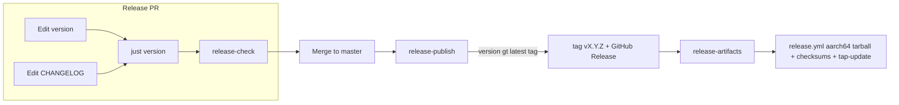

# Releasing Workpot

Manual version control — no Release Please, no separate release PR. Bump the version in the **same PR** you use to ship.

## Source of truth

Repo-root [`version`](../version) holds the workspace semver (no `v` prefix), e.g. `0.0.2`.

One command syncs every manifest and lockfile:

```bash
just version          # write/sync
just version-check    # verify only (CI uses this via release-check)
```

Updates: `crates/workpot-cli/Cargo.toml`, `crates/workpot-core/Cargo.toml`, `src-tauri/Cargo.toml` (including `workpot-core` path deps), `package.json`, `package-lock.json`, `src-tauri/tauri.conf.json`, and `Cargo.lock`.

## Ship checklist

1. Edit [`version`](../version) — must be **strictly greater** than the latest `v*` tag and than `master`'s current `version`.
2. Add a `## [X.Y.Z]` section to [`CHANGELOG.md`](../CHANGELOG.md) with at least one `- ` bullet.
3. Run `just version` and commit `version`, `CHANGELOG.md`, and all synced files.
4. Merge when CI is green (including **release-check**).

On push to `master`, [`release-publish.yml`](../.github/workflows/release-publish.yml) compares `version` to the latest tag. If it increased, it creates tag `vX.Y.Z` and a GitHub Release from the changelog section. [`release-artifacts.yml`](../.github/workflows/release-artifacts.yml) then builds and uploads macOS release artifacts via [`release.yml`](../.github/workflows/release.yml).

**Feature PRs** that do not touch `version` or `CHANGELOG.md`: `release-check` skips — no bump required.

## Flow



## PR gate: release-check

When a PR changes `version` or `CHANGELOG.md`, CI runs `scripts/check-release-pr.sh`:

| Check                 | Rule                                                                |
| --------------------- | ------------------------------------------------------------------- |
| Skip                  | No `version` or `CHANGELOG.md` in PR diff                           |
| Not below any release | `version` > latest `v*` tag (if any)                                |
| Ahead of master       | `version` > `origin/master:version`                                 |
| Sync drift            | All manifests/lockfiles match `version` (`just version-check`)      |
| Release notes         | `## [version]` with at least one `- ` bullet before the next `## [` |

## Artifacts per release

| Artifact                                   | Runner         | Contents                                                                                                                              |
| ------------------------------------------ | -------------- | ------------------------------------------------------------------------------------------------------------------------------------- |
| `Workpot-X.Y.Z-aarch64.tar.gz`             | `macos-latest` | `Workpot.app` (with `workpot-tray` Tauri binary and `workpot` CLI binary at `Contents/MacOS/workpot`), managed by Homebrew cask |
| `Workpot-X.Y.Z-aarch64.tar.gz.sha256`      | `macos-latest` | SHA-256 checksum for the tarball                                                                                                      |

## Signing and notarization policy

Workpot ships unsigned (no Apple Developer account). Distribution security is provided by Homebrew's `sha256` checksum verification on `brew install` and `brew upgrade`. The `postflight xattr -dr com.apple.quarantine` stanza in the Homebrew cask handles Gatekeeper. See `docs/distribution-strategy.md` for rationale.

## Release tag contract checklist

For every release tag (`vX.Y.Z`), keep these contracts aligned:

1. **PR gate:** `release-smoke` must pass with `v0.0.0-smoke` and validate only: `Workpot-0.0.0-smoke-aarch64.tar.gz` + `.sha256`
2. **Published release:** `release-artifacts` must upload: `Workpot-X.Y.Z-aarch64.tar.gz` + `.sha256`
3. **Tap auto-update:** after GitHub Release upload, `tap-update` job must push a version bump commit to `rubenlr/homebrew-workpot`

If any of these three disagree on tag or artifact names, treat the release as failed.

## Testing releases

| Phase        | Trigger                                                                             | Proves                                                    | Does not create     |
| ------------ | ----------------------------------------------------------------------------------- | --------------------------------------------------------- | ------------------- |
| **PR**       | [release-smoke.yml](../.github/workflows/release-smoke.yml) on release-path changes | aarch64-only tarball names/checksums match contract | Tag, GitHub Release |
| **PR**       | [ci.yml](../.github/workflows/ci.yml) `release-build`                               | Fast compile + `--version` on aarch64                     | Release assets      |
| **PR**       | `release-check` (when bumping version)                                              | Version sync + changelog                                  | Tag                 |
| **master**   | Push with increased `version`                                                       | Tag + GitHub Release + artifact upload                    | —                   |
| **Recovery** | `workflow_dispatch` on `release.yml`                                                | Re-upload artifacts for existing tag                      | New version         |

### PR smoke (`dry_run`)

[release-smoke.yml](../.github/workflows/release-smoke.yml) calls `release.yml` with `dry_run: true`: checks out the PR head, skips tag validation and `gh release upload`, uploads smoke artifacts (7-day retention).

### Recovery

| Situation                                       | Action                                                                        |
| ----------------------------------------------- | ----------------------------------------------------------------------------- |
| Artifacts failed but tag + GitHub Release exist | **Actions → release → Run workflow** — set `tag` to `vX.Y.Z`, `dry_run` false |
| Wrong tag vs `version` file                     | Upload fails at `validate-version` (expected)                                 |
| Re-test full matrix on a PR                     | Open/update PR; **release-smoke** runs on path changes                        |

Do **not** push `v*` tags manually for routine releases.

## Workflows reference

| Workflow                                                            | Role                                                                    |
| ------------------------------------------------------------------- | ----------------------------------------------------------------------- |
| [release-publish.yml](../.github/workflows/release-publish.yml)     | Push to `master` → tag + GitHub Release when `version` increases        |
| [release-artifacts.yml](../.github/workflows/release-artifacts.yml) | `release: published` → macOS build + upload                             |
| [release.yml](../.github/workflows/release.yml)                     | Guardrails, macOS builds, `gh release upload` (or smoke when `dry_run`) |
| [release-smoke.yml](../.github/workflows/release-smoke.yml)         | PR-only `dry_run` wrapper                                               |

## Squash commit = PR title + description

Configure once so squash merges default to PR title and description:

```bash
bash scripts/configure-github-merge-defaults.sh
```

Manual: **Settings → General → Pull requests** → _Allow squash merging_ → **Default to pull request title and description**.

Conventional **PR titles** (`feat:`, `fix:`, …) group changelog entries you write manually; they do not auto-bump the version.

## Distribution: Homebrew tap + cask

Workpot is distributed via `brew tap rubenlr/workpot` + `brew install rubenlr/workpot/workpot`. The cask installs `Workpot.app` in `/Applications` and symlinks the CLI binary onto `PATH`. See `docs/distribution-strategy.md` for the full decision record.
